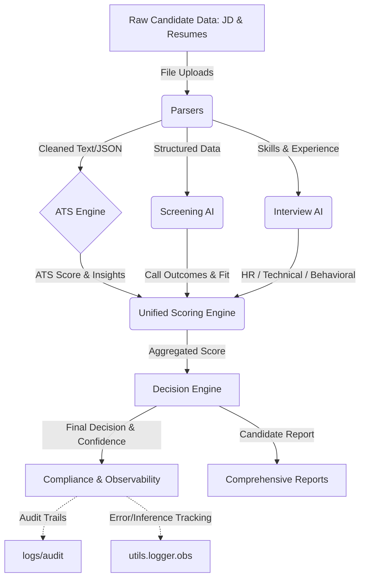

# Zecpath AI System Architecture

## 1. High-Level Architecture
Zecpath AI is a modular, multi-agent AI system designed to automate the hiring funnel from resume parsing to final decision-making. The system heavily leverages NLP, semantic matching, and dynamic weighted scoring engines to simulate human-level hiring decisions with explainability and compliance.

### 1.1 Architecture Mermaid Diagram

## 2. Core Modules

### 2.1 Parsers & Data Extractors (`parsers/`, `utils/`)
- **Functions:** Ingests PDFs, DOCXs, and plain text. Extracts experiences, parses education, cleans formatting text, and extracts skill nodes.
- **Key Files:** `utils/experience_utils.py`, `utils/text_cleaner.py`, `jd_parser.py`

### 2.2 ATS Engine (`ats_engine/`, `scoring/ats_scorer.py`)
- **Functions:** Compares extracted candidate data directly against Job Descriptions (JDs).
- **Sub-components:**
  - Semantic Matcher: Embeddings-based matching for unsaid qualifications.
  - Skill Score: Hard-requirement checking.
  - Experience Score: Checks bounding ranges for total months of valid work experience.

### 2.3 Screening AI (`screening_ai/`)
- **Functions:** Acts as the top-of-funnel validation voice. Detects communication skills, basic intent, and core readiness through conversational AI agents or basic automated Q&A.

### 2.4 Interview AI (`interview_ai/`, `machine_test/`)
- **Focus Areas:**
  1. *HR / Behavioral Interview*: Checks cultural alignment, behavioral integrity, and organizational fit.
  2. *Technical / Machine Test*: Tests hard coding skills via `technical_interview_blueprint.md`. Adapts question hierarchy based on candidate's real-time accuracy.

### 2.5 Dynamic Scoring & Cross-Round Engine (`scoring/`)
- **Functions:** The central brain that unifies isolated round results into a single candidate profile.
- **Weights Configuration:** Driven by role specific configurations (e.g., heavily weighting Technical round for Engineering, but weighting HR Round for Sales).
- **Classes:** `CrossRoundEngine`, `UnifiedCandidateScore`.

### 2.6 Decision Engine (`scoring/decision_engine.py`)
- **Functions:** Ingests the `UnifiedCandidateScore` to make the final determination: `Selected`, `Rejected`, or `Hold / Review`.
- **Integrity Validation:** Overrides standard score metrics if `Risk Tag = RED` indicating severe cheating/behavioral violations.

## 3. Observability & Auditing
- **ObservabilityManager** (`utils/logger.py`): Re-routes inference tracking, API latencies, error states, and logic flow audit trails across multiple log sinks using JSON formatter for aggregator consumption.
- **Audit Logging**: Securely tracks timestamped final hiring decisions for HR compliance.
