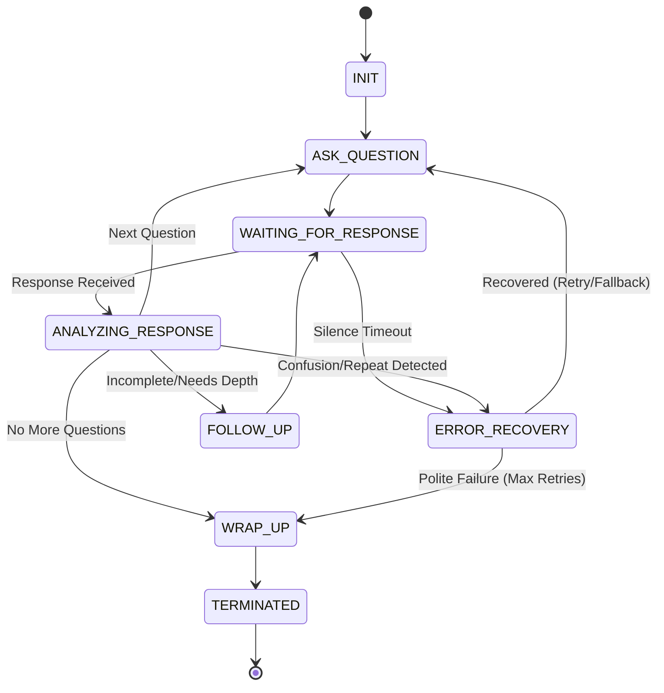

# AI Call Flow & Decision Tree Design

## 1. Overview
The AI Call Flow regulates dynamic interactions during candidate screening and interview calls. It manages conversation states, handles unexpected candidate behaviors (silence, confusion, repetition), and ensures smooth transitions between questions.

## 2. Conversation State Machine

The interaction is driven by a finite state machine (FSM) consisting of the following core states:

1. **`INIT`**: Greets the candidate and sets the context of the call.
2. **`ASK_QUESTION`**: Presents the primary interview or screening question to the candidate.
3. **`WAITING_FOR_RESPONSE`**: Listens for the candidate's audio/text input. Triggers a timeout if silence is detected.
4. **`ANALYZING_RESPONSE`**: Evaluates the response for semantic meaning, completeness, and error triggers (confusion, repetition).
5. **`FOLLOW_UP`**: Asks probing or clarifying questions if the answer was partial or lacks depth.
6. **`ERROR_RECOVERY`**: Dedicated state for handling conversational anomalies.
7. **`WRAP_UP`**: Concludes the call politely after all questions are answered or a polite failure occurs.
8. **`TERMINATED`**: Final state where the connection is closed.

## 3. Error-Handling Flow Design

### 3.1 Silence Handling
* **Trigger**: No input detected within `X` seconds.
* **Logic**:
  * **Attempt 1**: Polite nudge ("I didn't quite catch that. Are you still there?")
  * **Attempt 2**: Reiterate the question ("Just checking if you are still connected. To repeat the question...")
  * **Max Retries Reached**: Transition to `Polite Failure`.

### 3.2 Confusion Handling
* **Trigger**: Candidate states they don't understand, or response confidence score is extremely low.
* **Logic**:
  * **Attempt 1**: Rephrase the question using simpler terms.
  * **Attempt 2**: Ask a predefined simpler **fallback question** targeting the same core skill.
  * **Max Retries Reached**: Acknowledge and move on ("No worries, let's move on to the next topic.").

### 3.3 Repeated Answers
* **Trigger**: Candidate provides an answer semantically identical to a previous statement.
* **Logic**:
  * **Attempt 1**: Acknowledge and redirect ("It sounds like we touched on that. Could you elaborate specifically on [different aspect]?").
  * **Attempt 2**: Move to next question if candidate is stuck in a loop.

### 3.4 Follow-Up Triggers
* **Incomplete Answer**: Missing key expected metrics or STAR format elements (Situation, Task, Action, Result).
* **Vague Keywords**: Use of "things," "stuff," "managed a lot" without quantification.
* **Logic**: AI generates a specific probe ("You mentioned you improved efficiency. Could you share the percentage or metrics around that?").

### 3.5 Polite Failure & Retry Logic
If the conversation state machine reaches the maximum allowed consecutive errors (e.g., 3 consecutive silences or total failures to comprehend), it executes a **Polite Failure**:
> "It seems we might be experiencing some technical difficulties or having trouble connecting clearly. Let's pause here. Our recruitment team will reach out to you via email to continue this process. Thank you for your time today!"
Following this, the state transitions to `WRAP_UP` and safely saves the current progress.
