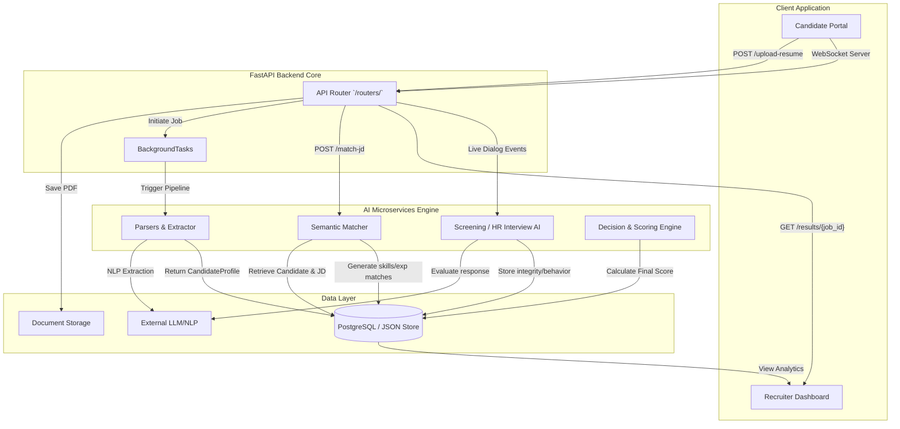

# AI System Integration & Architecture Design

This document defines how all AI modules within the Zecpath AI system integrate with backend services, frontend applications, and the central database. It standardizes the request/response formats, processing paradigms (sync vs async), error handling, and API security, directly mapping to our established entities (`CandidateProfile`, `JobProfile`, `SkillObject`, `ExperienceObject`).

## 1. Identification of Core AI APIs

The system exposes five primary AI workflows:

1. **Resume Parsing API (`/upload-resume`, `/parse-resume`)**: Extracts structured data (SkillObjects, ExperienceObjects) from raw PDFs.
2. **ATS Matching & Scoring API (`/match-jd`, `/score`)**: Evaluates structured `CandidateProfile` against `JobProfile` schemas.
3. **Screening AI API**: Chatbot/LLM-based preliminary screening test.
4. **Interview AI API**: Real-time behavioral & technical interview API (e.g., HR Interview logic).
5. **Decision AI API**: Final aggregation of scores across all rounds.

---

## 2. Integration Mapping: Backend → AI → Database



---

## 3. Synchronous vs. Asynchronous Processing

### Asynchronous Processing (BackgroundTasks)
* **Resume Parsing (`/upload-resume`)**: Handled via FastAPI `BackgroundTasks` because parsing PDFs and structuring `ExperienceObject` arrays via NLP can take time.
* **Bulk Scoring Pipeline**: Runs asynchronously to calculate `similarity_scores` over large applicant pools.

### Synchronous Processing (Real-time Latency Critical)
* **Direct Match & Score Tools (`/match-jd`, `/score`)**: Synchronous testing points or specific point-in-time requests.
* **Status Checks (`/status/{job_id}`)**: Immediate DB hit to check `BackgroundTasks` progress.
* **Interview AI**: WebSocket connections for conversational state-machines.

---

## 4. Request / Response Schema Definitions (JSON)

These schemas precisely follow the formats defined in `ATS_API_DESIGN.md` and properties from `DATA_ENTITY_DESIGN.md`.

### 4.1. Fast Async Resume Upload
**Endpoint**: `POST /upload-resume` (multipart/form-data)
**Request**: `file` (PDF/DOCX), `jd_id` (optional)
**Response `202 Accepted`**:
```json
{
  "job_id": "job_123abc",
  "message": "Resume uploaded successfully. Processing started.",
  "status_url": "/status/job_123abc"
}
```

### 4.2. Synchronous Parse Endpoint
**Endpoint**: `POST /parse-resume`
**Request**: `{"resume_id": "res_987xyz"}`
**Response `200 OK`**:
```json
{
  "resume_id": "res_987xyz",
  "skills": ["Python", "Transformers", "FastAPI"],
  "experience": [
    {
      "company": "Tech Corp",
      "job_title": "Software Engineer",
      "duration_months": 24,
      "description": "Developed backend APIs",
      "achievements": ["Improved latency by 20%"]
    }
  ],
  "education": [
    {
      "degree": "B.S. Computer Science",
      "institution": "University of Technology"
    }
  ]
}
```

### 4.3. Full Results API
**Endpoint**: `GET /results/{job_id}`
**Response `200 OK`**:
```json
{
  "job_id": "job_123abc",
  "status": "COMPLETED",
  "resume_id": "res_987xyz",
  "jd_id": "jd_456def",
  "parsed_data": {
    "skills": ["Python", "FastAPI"],
    "experience": [],
    "education": []
  },
  "scoring": {
    "similarity_scores": {
      "skills": 0.88,
      "experience": 0.75,
      "projects": 0.80
    },
    "final_score": 0.81,
    "decision": "SHORTLISTED"
  }
}
```

### 4.4. Interview AI API (WebSocket Sync)
**Protocol**: WSS `wss://api.domain.com/ws/v1/interview/{session_id}`

**Client Message (Candidate Response)**:
```json
{
  "action": "submit_answer",
  "question_id": "q_001",
  "transcription": "I primarily used Python for REST architectures.",
  "integrity_metrics": { "tab_switches": 0, "face_visible": true }
}
```

**Server Message (Evaluation & Next Action)**:
```json
{
  "action": "next_question",
  "transcription_score": 0.85,
  "next_question_type": "technical_drilldown",
  "text": "How did you manage database serialization in Python?"
}
```

---

## 5. Error Handling & Retry Mechanisms

1. **Custom Standard Error Object**:
   Returns standardized HTTP status codes (`400 Bad Request`, `404 Not Found`, `500 Internal Server Error`).
   ```json
   {
     "error": {
       "code": "INVALID_FILE",
       "message": "Unsupported file format. Please upload PDF or DOCX."
     }
   }
   ```
2. **Transient Issues (LLM Timeout)**:
   - Backend pipelines implement **Exponential Backoff**: (1s, 2s, 4s) when calling external NLP extraction APIs.
3. **Pipeline Failures**:
   - If `/parse-resume` background task fails, `GET /status/{job_id}` updates status to `FAILED` and appends an `error` object.

## 6. API Authentication & Security

1. **FastAPI Route Security (`mTLS` & Keys)**:
   - Synchronous internal micro-services (`/match-jd`, `/score`) are accessible via standard API keys or `mTLS` network restrictions if running in Docker Swarm/Kubernetes.
2. **Client-to-Service (JWT Authentication)**:
   - Candidate Portal accesses `/upload-resume` through short-lived signed JWTs in the `Authorization: Bearer <token>` header.
3. **Job Security**:
   - Only the UUID combination (`resume_id`, `job_id`) generated uniquely ensures users cannot query `/results/{id}` incrementally.
4. **Data Sanitization**:
   - Prompt sanitization occurs within FastAPI middleware to prevent standard LLM Injection via resume text inputs.
