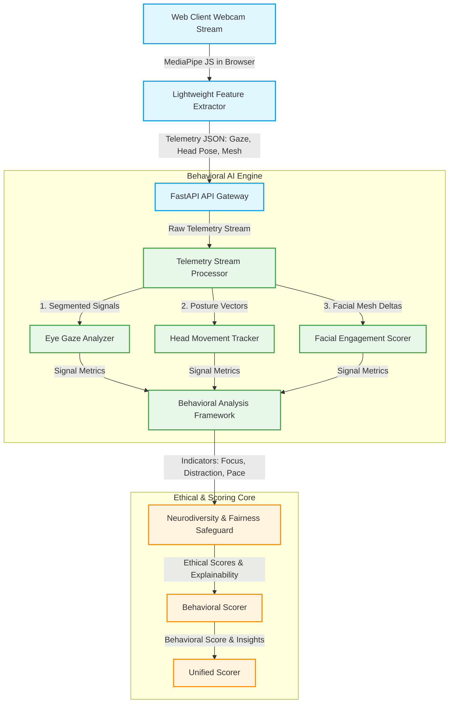

# Behavioral AI Design Document: Non-Invasive Video Analysis in Automated Hiring

This design document outlines the integration of **Video-Based Behavioral AI** into the automated hiring workflow of the AI-Powered Job Portal. It extends our existing speech-to-text (STT) and text-confidence analyzers (`confidence_analyzer.py`, `communication_scorer.py`) with real-time video telemetry analysis (eye gaze, head movement, facial engagement, attention patterns).

Importantly, this design prioritizes **Non-Invasive & Ethical AI** standards to prevent discrimination against neurodivergent candidates or those with physical disabilities/cultural variations in gaze and expression.

---

## 1. System Topology & Video Telemetry Pipeline

The Behavioral AI pipeline processes real-time webcam video frames through lightweight edge-based feature extractors (e.g., using MediaPipe or WebRTC-based local extraction) to obtain high-level coordinates (gaze vectors, facial mesh landmarks, head pose angles) without saving raw video streams. This ensures strict privacy compliance (GDPR/CCPA and EU AI Act).



---

## 2. Research: Observable Behavioral Signals

The system measures four primary observable signals extracted from raw camera frames:

### A. Eye Movement & Gaze Stability
*   **Physics of the Gaze**: Calculated using the relative distance between the iris center and the eye corners (inner/outer canthus), yielding a 2D gaze vector $(g_x, g_y)$ and gaze stability variance $\sigma^2_g$.
*   **Horizontal Saccades**: Rapid, sequential horizontal movements of the eyes. Constant horizontal reading motions suggest the candidate is looking at a script (teleprompter/cheat sheet).
*   **Vertical Gaze Drops**: Consistent downward gazes while answering questions, which may indicate reading pre-written notes.
*   **Natural Conversational Gaze**: Human communication involves periodic gaze shifts (looking up/away briefly to think). This is normal cognitive processing, not distraction.

### B. Head Movement
*   **Pose Estimation**: Calculated using a 3D projection of key facial features (nose tip, chin, eye corners, mouth corners) to resolve Yaw (left/right turn), Pitch (up/down tilt), and Roll (side tilt) angles.
*   **Micro-movements & Shaking**: High-frequency micro-oscillations in head yaw or roll, often correlated with somatic nervous tension.
*   **Nodding Dynamics**: Periodicity and intensity of vertical head nodding, representing dynamic engagement, affirmation, or active pacing.
*   **Head Orientation**: Duration and frequency of turning the face completely away from the screen ($> 30^\circ$ Yaw deviation).

### C. Facial Engagement
*   **Action Unit (AU) Deltas**: Measures the movement of facial muscles based on distance changes between key landmarks on the face (eyebrows, mouth corners, jawline).
    *   *AU12 (Lip Corner Puller)*: Measures smiling activity.
    *   *AU1/2 (Inner/Outer Brow Raiser)*: Measures expressiveness and questioning/thinking patterns.
    *   *AU26 (Jaw Drop)*: Tracks active speech movement.
*   **Expressiveness Index**: The standard deviation of facial muscle configurations over time. A highly static face might represent fatigue, flat affect, or disengagement, while an expressive face represents dynamic communication.
*   **Blink Rate ($B_r$)**: Average blinks per minute (normally 12-20). Extremely high blink rates ($> 45$ BPM) indicate acute stress or dry-eye strain, while very low blink rates ($< 6$ BPM) represent deep focus or screen-staring.

### D. Attention Patterns
*   **Presence Ratio ($P_r$)**: The percentage of the interview time during which the candidate's face is successfully detected and positioned inside the central camera frame.
*   **Distraction Events**: Sudden, continuous looking away from the camera ($> 4$ seconds) accompanied by silence, or sudden, rapid looking off-camera while speaking.
*   **Response Pacing Coherence**: Aligning gaze changes with speech patterns. For example, looking away during a silence indicates a natural "thinking pause," whereas looking away *while speaking* fluently can indicate reading a prepared response.

---

## 3. Measurable Behavioral Indicators

To transform raw telemetry signals into human-understandable insights, we group them into three primary measurable indicators:

| Indicator | Extracted From | Mathematical Calculation | Operational Meaning |
| :--- | :--- | :--- | :--- |
| **Focus Level** | Gaze Stability, Head Yaw/Pitch, Presence | Percentage of time candidate's gaze and face are aligned with the camera/screen frame ($|g_x| < \theta_{g\_max}$ and $|Yaw| < 25^\circ$), excluding natural thinking pauses. | Measures active attention and presence during the conversation. |
| **Distraction Frequency** | Gaze Outliers, Off-frame Events | Count of continuous out-of-bounds gaze or head deviations ($> 3$ seconds) normalized by interview duration in minutes. | Detects external events, multi-screen usage, or disengagement. |
| **Nervous Gestures** | Rapid Blinking, Face-touches, Micro-tremors | Frequency of excessive blinking ($> 45$ BPM), high-frequency head roll oscillations, or face contact landmarks overlap. | Identifies somatic stress markers without penalizing verbal delivery. |

---

## 4. Signal-to-Insight Mapping

To maintain recruiter transparency, behavioral telemetry must be mapped to descriptive, supportive insights rather than simplistic labels.

```
                      [ Raw Telemetry Streams ]
                                  |
            +---------------------+---------------------+
            |                                           |
    [ Gaze Reading Pattern ]                   [ Off-Camera Looking ]
    (Horizontal saccades, speech)              (Yaw > 30 deg, > 4s)
            |                                           |
    +-------v-------+                           +-------v-------+
    | Potential     |                           | High External |
    | Teleprompter  |                           | Distraction   |
    | Script Reading|                           | or MultiScreen|
    +---------------+                           +---------------+
```

### Mapping Rules:
1.  **Insight: Strong Conversational Engagement**
    *   *Signals*: Stable gaze, natural vertical nodules ($0.1 - 0.5$ Hz), responsive facial deltas (smiles/brow-raises) matching speech sentiment.
2.  **Insight: Reading from an External Script (Teleprompter)**
    *   *Signals*: Systematic horizontal eye saccades while speaking, zero head movement (head frozen), and low gaze stability variance along the X-axis with zero along the Y-axis.
3.  **Insight: Multi-Screen Distraction**
    *   *Signals*: Frequent, long gaze offsets ($> 4$ seconds) to a specific off-center quadrant, accompanied by head rotation towards the same quadrant.
4.  **Insight: Somatic Stress / Processing Tension**
    *   *Signals*: Spikes in blink rate ($> 50$ BPM), minor head roll oscillations during silence, and natural cognitive pauses.

---

## 5. Non-Invasive & Ethical Scoring Model

Applying standard behavioral scoring models often discriminates against **neurodivergent candidates** (e.g., individuals on the Autism spectrum who avoid eye contact, or those with ADHD who show higher physical movement/distraction vectors). 

To solve this, our design incorporates a **Non-Invasive, Neurodiversity-Safe Safeguard Engine**:

> [!IMPORTANT]
> **Ethical Principle: Within-Candidate Baseline Normalization (WCBN)**
> The system *never* scores a candidate against a fixed external population standard. Instead, it uses the candidate's own **Introduction Phase (Greeting)** to establish their individual, natural behavioral baseline. The subsequent scoring only measures deviations relative to their *own* baseline.

### Ethical Guardrails:
1.  **Cognitive Pause Safeguard**:
    *   Gaze deviation that occurs during **silence** or **hesitant speech** (searching for words) is classified as a *Cognitive thinking pause* and is excluded from the distraction penalty.
2.  **Gaze-Contact Exemption**:
    *   Candidates who consistently look away (low gaze stability) throughout the *entire* interview are classified as having a *non-standard gaze baseline*. The system **exempts** eye-gaze metrics from their final score, relying instead on verbal communication consistency and head pose presence.
3.  **Supportive Bias Adjustment (The Neuro-Shield)**:
    *   Behavioral AI metrics can **never decrease** a candidate's core interview score by more than **5%** for nervousness or fidgeting, but can **increase** the score by up to **5%** for exceptionally high focus and presence.
    *   Serious integrity alerts (e.g., clear proof of another person talking or reading continuous scripts) are flagged as **Integrity Notes** for human review rather than being converted into an automatic rejection score.

---

## 6. Project Flow Integration

The Behavioral AI Score will act as a supplemental component of the **HR Interview Scorer**. 

### Weights Adjustments:
We update the **HR Interview Weight Matrix** within `weights_config.py` to seamlessly integrate behavioral signals:

$$\text{Final HR Score} = (\text{Relevance} \times 0.30) + (\text{Communication} \times 0.20) + (\text{Confidence} \times 0.15) + (\text{Consistency} \times 0.15) + (\text{Behavioral AI} \times 0.20)$$

If a candidate is exempted due to neurodiverse indicators, the system dynamically re-allocates the 20% Behavioral AI weight back to the standard text-based metrics (Relevance, Communication, Confidence, and Consistency), preserving absolute score fairness!

> [!TIP]
> **Recruiter Dashboard Output**:
> Recruiters will see behavioral indicators as "Behavioral Focus Analytics" with descriptive, supportive feedback:
> *   *Focus Index: 92% (High presence, consistent alignment)*
> *   *Integrity Trust: High (Natural speaking dynamics)*
> *   *Ethics Note: Eye-contact metrics adjusted dynamically to ensure neurodiverse fairness.*
