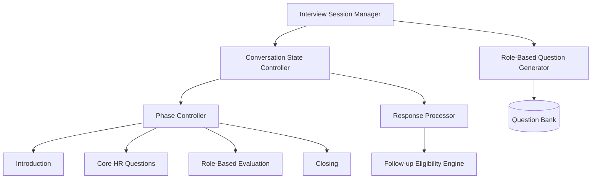

# HR Interview AI Architecture Design

## 1. HR Interview AI Structure Diagram



## 2. HR Interview Categories

The AI interview revolves around the following core categories:
1. **Self-introduction**: Ice breaker, background overview.
2. **Career journey**: Past experiences, transitions, and growth.
3. **Strengths & weaknesses**: Self-awareness and improvement areas.
4. **Teamwork & culture fit**: Collaboration, conflict resolution, alignment with company values.
5. **Career goals**: Short-term and long-term aspirations.
6. **Availability & commitment**: Logistics, notice periods, relocation, shifts.

## 3. Question Bank Architecture

The Question Bank is structured to allow dynamic filtering based on category, role type, and experience level.

```json
{
  "questions": [
    {
      "id": "HR_SW_001",
      "category": "Strengths & weaknesses",
      "text": "What would you say is your greatest professional strength?",
      "target_experience": ["fresher", "experienced"],
      "target_role": ["technical", "non-technical"],
      "follow_up_eligible": true,
      "expected_intents": ["strength_mention", "example_provided"]
    },
    {
      "id": "HR_TW_002",
      "category": "Teamwork & culture fit",
      "text": "Tell me about a time you had a disagreement with a team member. How did you resolve it?",
      "target_experience": ["experienced"],
      "target_role": ["technical", "non-technical"],
      "follow_up_eligible": true,
      "expected_intents": ["conflict_resolution", "collaboration"]
    }
  ]
}
```

## 4. Role-Based Question Generator

The generator selects appropriate questions based on candidate metadata.

*   **Experience Level Filtering:**
    *   **Fresher:** Focuses on academic projects, internships, learning agility, and theoretical application.
    *   **Experienced:** Focuses on real-world problem solving, leadership, past project impact, and career progression.
*   **Role Type Filtering:**
    *   **Technical:** Includes questions about tech stack adaptation, technical conflict resolution, and problem-solving methodologies.
    *   **Non-technical:** Focuses on communication, process management, client interaction, and organizational skills.

## 5. Interview State Structure

The state structure maintains the context of the ongoing interview.

```python
class InterviewState:
    def __init__(self):
        self.session_id: str
        self.candidate_id: str
        self.current_phase: str # e.g., "core_hr"
        self.current_question_id: str
        self.asked_questions: List[str]
        self.responses: List[ResponseCapture]
        self.follow_up_eligibility: bool # True if the AI can ask a follow-up
        self.turn_count: int

class ResponseCapture:
    def __init__(self):
        self.question_id: str
        self.candidate_transcript: str
        self.extracted_intents: List[str]
        self.sentiment: str
        self.completeness_score: float
```

## 6. Interview Flow Design Document (Conversation Phases)

The interview is divided into four distinct phases:

### Phase 1: Introduction
*   **Objective:** Welcome the candidate, set the context, and check audio/readiness.
*   **Action:** AI greets the candidate, explains the interview format, and asks for a brief self-introduction.
*   **Exit Condition:** Candidate provides a self-introduction.

### Phase 2: Core HR Questions
*   **Objective:** Evaluate fundamental HR criteria (culture fit, strengths/weaknesses, career journey).
*   **Action:** Ask 2-3 standard HR questions based on the candidate's experience level.
*   **Exit Condition:** Core HR questions answered with sufficient detail.

### Phase 3: Role-Based Evaluation
*   **Objective:** Assess alignment with the specific role (Technical vs Non-technical).
*   **Action:** Generate and ask questions tailored to the candidate's profile. AI dynamically triggers follow-ups if an answer is incomplete or lacks depth.
*   **Exit Condition:** Required role-based questions are completed.

### Phase 4: Closing
*   **Objective:** Finalize logistics and conclude the session.
*   **Action:** Ask about availability, commitment (notice period, location), and allow the candidate to ask any final questions.
*   **Exit Condition:** Formal sign-off and call termination.
