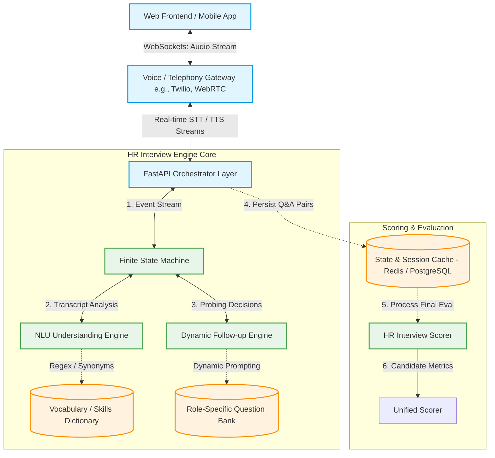
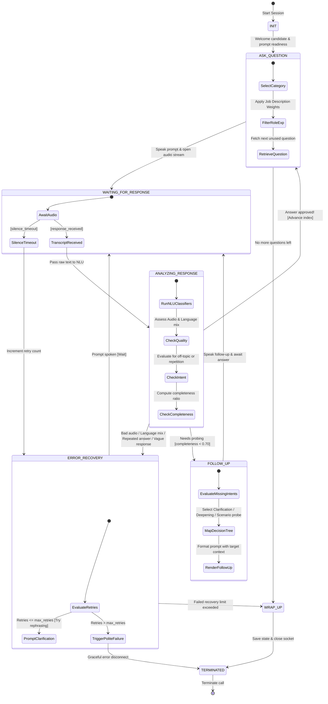

# HR Interview AI Architecture Design Document

The **HR Interview AI** is an intelligent, real-time conversational voice agent designed to automate the screening and cultural fit assessment of candidates. By combining a conversational **Finite State Machine (FSM)** with **Natural Language Understanding (NLU)**, a **Dynamic Probing Engine**, and a **Multi-Round Unified Scorer**, this system conducts structured, adaptive, and highly professional interviews.

---

## 1. System Topology & Context Architecture

The HR Interview AI fits seamlessly into a high-concurrency cloud telephony or web-based video/audio system. Below is the high-level system boundary and component integration model:



---

## 2. Conversation Finite State Machine (FSM)

The flow of each call is governed by a synchronous, deterministic state machine (`ConversationStateMachine`) to protect against conversational loop-locks, awkward silence, or bad quality inputs. 

### State Transition Diagram



### Conversational States & Actions
*   **`INIT`**: Greets the candidate and sets up context parameters (`candidate_id`, `session_id`, `role`, `experience`).
*   **`ASK_QUESTION`**: Generates and selects the next structured interview question dynamically filtering by category, role, and experience level.
*   **`WAITING_FOR_RESPONSE`**: Listens for voice data. Operates a dynamic **silence detection timer** (typically 3-5 seconds of continuous silence ends the turn).
*   **`ANALYZING_RESPONSE`**: Executes intent classification and quality assurance on the incoming text transcript.
*   **`FOLLOW_UP`**: Engages candidate dynamically to flesh out vague answers before moving on.
*   **`ERROR_RECOVERY`**: Resolves conversation anomalies, rephrasing confused queries, or filtering repeated input.
*   **`WRAP_UP`**: Handles the final logistics collection (notice period, expectations) and reads the exit prompt.
*   **`TERMINATED`**: Ends execution, disconnects the channel, and pushes telemetry to the database.

---

## 3. NLU Answer Understanding Engine

The `AnswerUnderstandingEngine` acts as the semantic interpreter of candidate audio transcripts. It transforms unstructured conversational transcripts into structured data models using robust keyword classifiers and pattern-matching NLP pipelines.

### Data Entity Schemas
Downstream evaluation microservices consume candidate responses via standardized Pydantic models:

```python
class ExtractedEntities(BaseModel):
    """
    Captures concrete parameters spoken by the candidate in the transcript.
    """
    skills: List[str] = Field(default_factory=list, description="List of standardized skills extracted")
    experience_years: Optional[float] = Field(None, description="Decimal years of professional experience mentioned")
    availability: Optional[str] = Field(None, description="Notice period duration or availability timeline")
    salary_expectation: Optional[str] = Field(None, description="Compensation amount or band verbalized")

class StructuredAnswer(BaseModel):
    """
    Consolidated NLU output representing candidate response telemetry.
    """
    raw_transcript: str
    cleaned_transcript: str
    intent: Literal["direct_answer", "clarification_needed", "off_topic", "refusal_to_answer", "partial_answer", "unknown"]
    is_off_topic: bool
    is_vague_or_missing: bool
    missing_answer: bool
    language_mixed: bool
    confusion_detected: bool
    repeated_detected: bool
    extracted_data: ExtractedEntities
    confidence_score: float
```

### NLU Classifiers and Regex Parsers
*   **Intent Classifier**: Analyzes the transcript structure. Short responses (< 4 words) match `partial_answer`. Pre-compiled keyword lists detect `clarification_needed` (e.g., "what do you mean?", "repeat"), `refusal_to_answer` (e.g., "skip", "pass", "don't know"), and `off_topic` (e.g., "weather", "sports", "recipe").
*   **Language-Mixing Detector**: Identifies when a candidate slips into other languages or mixes non-English words (`hola`, `namaste`, `bonjour`).
*   **Vague / Missing Check**: Computes the word-count ratios. Responses matching vague patterns (e.g., "some stuff", "various things") with short lengths (< 25 words) are flagged as vague to trigger dynamic probing.
*   **Regex Entity Extractors**:
    *   *Experience*: `(\d+(?:\.\d+)?)\s*(?:years|yrs?)(?:\s*of)?\s*(?:experience|working)?`
    *   *Salary*: `(\$?\d{2,3}[kK]|\$?\d{1,3}(?:,\d{3})+)`
    *   *Availability*: `(immediate(?:ly)?|\d+\s*(?:days|weeks|months)\s*(?:notice)?)`

---

## 4. Dynamic Probing & Follow-up Engine

To prevent candidates from skipping through questions with simple "yes" or "no" answers or overly brief replies, the `FollowUpEngine` analyzes answers in real-time, matching details against expected intents, and applies a structured Decision Tree to solicit detail.

### Probing Decision Tree
```text
                       [Evaluate completeness_score & missing_intents]
                                              |
                     +------------------------+------------------------+
                     |                                                 |
            [completeness < 0.4]                             [completeness >= 0.4]
                     |                                                 |
          +----------v----------+                             +--------v--------+
          |  Clarification      |                             |                 |
          |  Probe              |                     [has missing intents?]    |
          +---------------------+                             |                 |
                                                   +----------+----------+      |
                                                   |                     |      |
                                                 [Yes]                  [No]    |
                                                   |                     |      |
                                        +----------v----------+          |      |
                                        |  Example-based      |          |      |
                                        |  Probe              |          |      |
                                        +---------------------+          |      |
                                                                         |      |
                                                             [completeness < 0.7]
                                                                         |      |
                                                           +-------------+---+  |
                                                           |                 |  |
                                                         [Yes]              [No]|
                                                           |                 |  |
                                                +----------v----------+ +----v----+
                                                |  Deepening          | | Scenario|
                                                |  Probe              | | Probe   |
                                                +---------------------+ +---------+
```

### Probing Framework Profiles
1.  **Clarification Probe**: Triggers on very brief or low-scoring responses.
    *   *Prompt Pattern*: *"Could you elaborate a bit more on that? I'd love to hear some additional details."*
2.  **Example-based Probe**: Triggers when specific core intents are expected from the question bank but omitted in the response.
    *   *Prompt Pattern*: *"That's interesting. Can you provide a specific real-world example related to {missing_intent}?"*
3.  **Deepening Probe**: Triggers when the response has basic detail but lacks depth or justification.
    *   *Prompt Pattern*: *"Why did you choose to take that specific approach over other potential options?"*
4.  **Scenario-based Probe**: Triggers on highly competent answers (completeness >= 0.70) to challenge and assess high-level reasoning.
    *   *Prompt Pattern*: *"That sounds like a solid approach. How would your strategy change if you had half the time to complete it?"*

### Conversation Guard Rails
*   **Maximum Probes Ceiling**: Hard-capped at a maximum of **2 follow-ups per question** to prevent candidate exhaustion or irritation.
*   **Question Eligibility**: Explicitly checks `follow_up_eligible: true` from the `hr_question_bank.json` configuration before invoking the probing engine.
*   **Repetition Deflection**: Prevents generating the same probe angle successively by logging follow-up question IDs inside `InterviewState.asked_questions` as `FU_{base_question_id}_{turn_number}`.

---

## 5. Scoring Logic & Dynamic Multi-Round Evaluation

Candidate evaluation is structured mathematically across two levels: **HR Interview Evaluation** (focused on communication, relevance, and consistency) and **Unified Evaluation** (consolidating resume, screening, and interview rounds).

### A. HR Interview Scorer (HRInterviewScorer)
The final HR Interview Score (0-100%) is calculated dynamically based on a weighted average of four categorical signals:

$$\text{Final HR Score} = (\text{Relevance} \times 0.35) + (\text{Communication} \times 0.25) + (\text{Confidence} \times 0.20) + (\text{Consistency} \times 0.20)$$

#### Component Breakdown:
1.  **Answer Relevance (35% Weight)**:
    *   *Calculation*: Computes overlap between question key terms and candidate verbalized text, factored against answer length ratio ($L_{ratio} = \min(1.0, \frac{\text{word count}}{12.0})$).
    *   *Safety Floor*: Substantive, long answers (>= 10 words) that fail exact keyword overlap default to a baseline floor score of **70%** (plus minor overlap bonuses) to prevent penalizing candidates for using diverse vocabularies.
2.  **Communication Score (25% Weight)**:
    *   *Calculation*: Tracks speech quality, grammar, and fluency. Lowers scores based on high densities of filler words (e.g., "uh", "um", "like", "actually") or repetitive phrasing.
3.  **Confidence Analyzer (20% Weight)**:
    *   *Calculation*: Performs acoustic/text sentiment parsing to evaluate confidence levels. Subtracts points when stress indicators or excessive hesitations are flagged.
4.  **Consistency score (20% Weight)**:
    *   *Calculation*: Measures the uniformity of responses across the whole interview.
    *   *Mathematical Variance Check*: Calculates the standard deviation of response word-lengths and sentiment shifts. Extreme variances (mood swings, or moving from detailed answers to one-word brush-offs) trigger consistency penalties.

#### Normalization:
To guarantee fairness, the score is averaged across the total number of questions asked. This guarantees that a candidate asked 3 questions is scored on the same absolute 0-100% scale as a candidate asked 5 questions (due to follow-up probes).

---

### B. Unified Scorer (UnifiedScorer)
Once the candidate completes the entire pipeline, the system merges all hiring checkpoints (Resume ATS check, Telephone Screening, and Live HR Interview) using **Dynamic Role-Based Weights**:

```mermaid
classDef default fill:#f9f9f9,stroke:#333,stroke-width:1px;
classDef tech fill:#e1f5fe,stroke:#0288d1,stroke-width:2px;
classDef leader fill:#f3e5f5,stroke:#7b1fa2,stroke-width:2px;
classDef sales fill:#efebe9,stroke:#5d4037,stroke-width:2px;
classDef intern fill:#e8f5e9,stroke:#388e3c,stroke-width:2px;

graph TD
    A[Raw Candidate Rounds] --> B{Role Categorization}
    
    B -->|Software/Data Roles| C[Technical Weights]:::tech
    B -->|Management Roles| D[Leadership Weights]:::leader
    B -->|Marketing/Sales| E[Customer Facing Weights]:::sales
    B -->|Junior/Interns| F[Entry Level Weights]:::intern
    
    C -->|ATS 45% / Screen 35% / HR 20%| G[Final Unified Score]
    D -->|ATS 30% / Screen 20% / HR 50%| G
    E -->|ATS 20% / Screen 30% / HR 50%| G
    F -->|ATS 25% / Screen 50% / HR 25%| G
```

#### Multi-Round Weight Configuration:

| Role Category | ATS Score Weight | Screening Score Weight | HR Interview Weight | Primary Focus / Justification |
| :--- | :---: | :---: | :---: | :--- |
| **Technical** | 45% | 35% | 20% | Heavily weights technical skills, experience alignment, and hard skills. |
| **Leadership** | 30% | 20% | 50% | Focused on communication, conflict resolution, values, and emotional IQ. |
| **Customer Facing**| 20% | 30% | 50% | Prioritizes speech clarity, professional presence, and conversational poise. |
| **Entry Level** | 25% | 50% | 25% | Focuses on learning agility and foundational answers (Voice Screening). |
| **Default** | 33% | 33% | 34% | Equitable distribution across all candidate evaluation steps. |

#### Unified Hiring Fit Readiness Bands:
The aggregated score is mapped to four distinct operational recommendation bands:
*   **$\ge$ 85%**: *Exceptional Fit (Fast-Track Offer)*
*   **70% - 84%**: *Strong Fit (Proceed to Offer)*
*   **55% - 69%**: *Borderline Fit (Needs Team Review)*
*   **< 55%**: *Poor Fit (Reject)*
