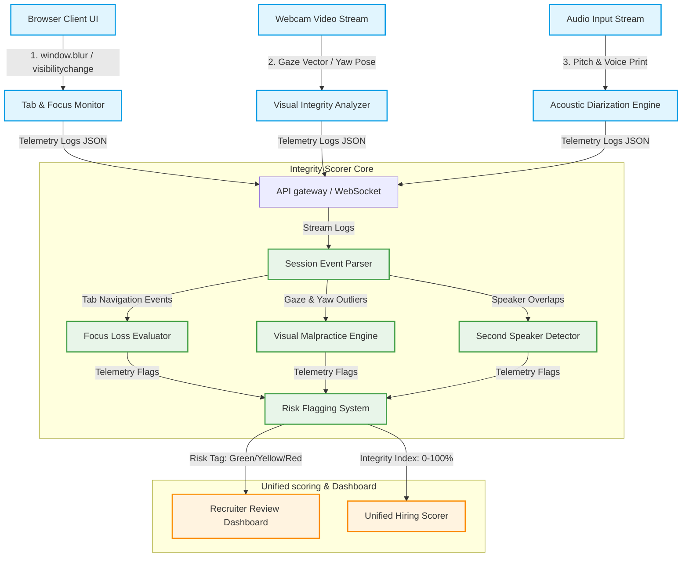

# Integrity & Malpractice Detection Design Document

This document outlines the architecture, signals, detection logic, and flagging system designed to safeguard the security and validity of virtual video-based interviews. It integrates **Client-side telemetry (browser events)**, **Computer Vision streams (gaze/head pose)**, and **Audio Intelligence (speaker diarization)** to flag potential cheating or external assistance.

Importantly, this framework is designed in alignment with our **AI Ethics and Human-in-the-Loop (HITL)** guidelines. It acts as an audit assistant for human recruiters rather than an automated executioner.

---

## 1. System Topology & Signal Pipeline

The Integrity Detection System integrates multi-modal telemetry streams collected during the candidate's interview session. Raw signals are parsed locally to protect candidate privacy before transmitting metadata to the backend `IntegrityScorer`.



---

## 2. Observable Malpractice Signals

We define four high-fidelity malpractice signals collected throughout the interview:

### A. Tab Switching Frequency ($N_{tab}$)
*   **Mechanism**: Captured via the browser HTML5 Page Visibility API by listening to the `visibilitychange` event on the document.
*   **Significance**: Measures how often the candidate minimizes the interview page or navigates to another browser tab (presumably searching for terms or navigating a cheat sheet).

### B. Loss of Screen Focus ($T_{blur}$)
*   **Mechanism**: Captured via window `blur` and `focus` events.
*   **Significance**: Measures the total duration (in seconds) the candidate spends interacting with a window outside of the browser frame (e.g., accessing ChatGPT, local text documents, or messaging applications on a second monitor).

### C. External Voice Detection ($V_{ext}$)
*   **Mechanism**: Calculated using audio-stream frequency analysis (pitch variance) and acoustic speaker diarization.
*   **Significance**: Identifies when a second voice (e.g., an accomplice speaking in the room or feeding answers) is verbalized.
*   **Co-occurrence Analysis**: Evaluated against the candidate's own vocal range. High confidence alerts trigger when a second distinct vocal signature occurs concurrently with or immediately before the candidate speaks.

### D. Repeated Looking Away ($G_{away}$)
*   **Mechanism**: Extracted from the `BehavioralScorer` gaze coordinates ($g_x, g_y$) and 3D head pose Yaw rotation.
*   **Significance**: Measures consistent visual focus offsets (looking to the side, below, or off-camera) during questions or immediately before starting to speak, signifying communication with a physical accomplice or reading from a second physical device.

---

## 3. Malpractice Detection Logic

Malpractice detection is divided into **Threshold-Based Rules** (immediate alerts) and **Pattern Recognition** (assessing intent).

### A. Threshold-Based Flags

| Malpractice Event | Moderate Violation Trigger | Major Violation Trigger | Recruiter Insight |
| :--- | :---: | :---: | :--- |
| **Tab Minimization** | $\ge 2$ switches | $\ge 4$ switches | Frequent switching suggests active off-screen searching. |
| **Screen Blur Duration** | $\ge 8$ seconds | $\ge 20$ seconds | Extended blur indicates active interaction with external helper apps. |
| **Second Speaker Voice** | $\ge 1$ occurrence ($>65\%$ confidence) | $\ge 2$ occurrences ($>80\%$ confidence) | Confirms an external person is feeding answers inside the room. |
| **Sideways Gaze Outliers** | $\ge 4$ deviations ($>3$s each) | $\ge 8$ deviations ($>3$s each) | Indicates looking off-screen towards secondary devices or accomplices. |

---

### B. Pattern Recognition (Coordinated Malpractice)

Simple thresholds can misflag natural events (e.g., closing a popup, look-away to think). To guarantee accuracy, we apply two multi-modal pattern templates:

#### 1. Coordinated Search Pattern (CSP)
Detects searching for answers immediately after a question is asked:
*   *Sequence*: 
    1. AI starts reading a question $\rightarrow$ 
    2. Within 5 seconds, a browser `blur` event is triggered $\rightarrow$ 
    3. The screen remains out of focus for $5 - 15$ seconds $\rightarrow$ 
    4. Screen focus returns $\rightarrow$ 
    5. The candidate immediately begins speaking a highly structured response.
*   *Logic*: CSP flag increments by 1. Highly indicative of copy-pasting the question.

#### 2. Accomplice Cue Pattern (ACP)
Detects reading answers off-screen while pretending to speak fluently:
*   *Sequence*:
    1. Vocal audio is active (candidate is speaking) $\rightarrow$ 
    2. Head pose Yaw deviation $> 25^\circ$ or gaze coordinates $g_x > 0.45$ for $> 4$ seconds concurrently $\rightarrow$ 
    3. Verbal delivery matches high speech confidence (zero fillers or hesitations).
*   *Logic*: ACP flag increments. Highly indicative of reading pre-typed answers fed by an accomplice on another monitor.

---

## 4. Warning & Flagging System Design

The system implements a dual-layer alerting system: **Real-Time Candidate Deflection** and **Recruiter Risk Tagging**.

### A. Real-Time Warnings (Candidate Deflection)
To prevent candidates from continuing malpractice, the FSM state machine receives telemetry triggers and injects interactive warning events.

```text
                                [ Malpractice Event ]
                                          |
                        +-----------------+-----------------+
                        |                                   |
                  [ 1st Occurrence ]                  [ 2nd Occurrence ]
                        |                                   |
             +----------v----------+             +----------v----------+
             |   Soft Alert Box    |             |   Hard Warning Box  |
             | "Please focus on the|             | "Action Logged.     |
             |  interview tab."    |             |  Continued blur will|
             |                     |             |  flag session."     |
             +---------------------+             +---------------------+
```

*   **FSM Redirection**: In extreme situations, the conversational state machine transitions to `ERROR_RECOVERY` and reads an explicit warning prompt:
    *   *AI Audio Prompt*: *"I noticed you have navigated away from the interview screen multiple times. To maintain the integrity of our assessment, please keep this window active."*

---

### B. Recruiter Risk Tagging

Once the interview is concluded, the `IntegrityScorer` assigns an **Integrity Score (0-100%)** and groups candidates into three distinct **Risk Categories**:

> [!NOTE]
> **Risk Tag: GREEN (Low Risk)**
> *   *Criteria*: Integrity Score $\ge 90\%$. Under 2 tab switches, zero speaker overlaps, and zero coordinated search patterns.
> *   *Action*: Candidate proceed directly along the standard shortlisting pipeline.

> [!WARNING]
> **Risk Tag: YELLOW (Medium Risk)**
> *   *Criteria*: Integrity Score $70\% - 89\%$. Minor tab navigation ($2-3$ blurs) or slight off-screen looking during questions.
> *   *Action*: Logs an **Integrity Warning** on the recruiter dashboard with a timestamp breakdown of focus losses, highlighting areas to double-check.

> [!CAUTION]
> **Risk Tag: RED (High Risk)**
> *   *Criteria*: Integrity Score $< 70\%$. Triggered by a second speaker detection, CSP detection, or $\ge 4$ screen focus losses.
> *   *Action*: Caps the Unified Hiring Score at $45\%$ maximum, tags the profile as **"High Integrity Risk"**, and redirects the application to a **Mandatory Recruiter Review Queue** for manual audio/video audit.

---

## 5. Integration with Behavioral Signals

Integrity scores are integrated natively as a **modifying penalty** within the unified evaluation:

```
                            [ Raw Unified score ]
                                      |
                      +---------------+---------------+
                      |                               |
             [ Integrity = GREEN ]           [ Integrity = RED ]
                      |                               |
             [ Apply standard weights ]      [ Cap Unified Score at 45% ]
             [ No penalty applied     ]      [ Flag for Human Audit     ]
```

*   **Weight Re-allocation (Neutralization)**:
    If a candidate has a **Green** integrity profile, their behavioral focus signals (attention level, stability) remain fully active, giving them positive credit.
*   **The Cheat-Capping Mechanism**:
    If the Integrity Score falls under $70\%$ (Red), the system automatically triggers a **Hiring Hold** flag in `unified_scorer.py`. This blocks automated recruitment emails (offer/shortlist) and guarantees that a **human-in-the-loop recruiter** must visually audit the session recordings before any actions can be taken.
