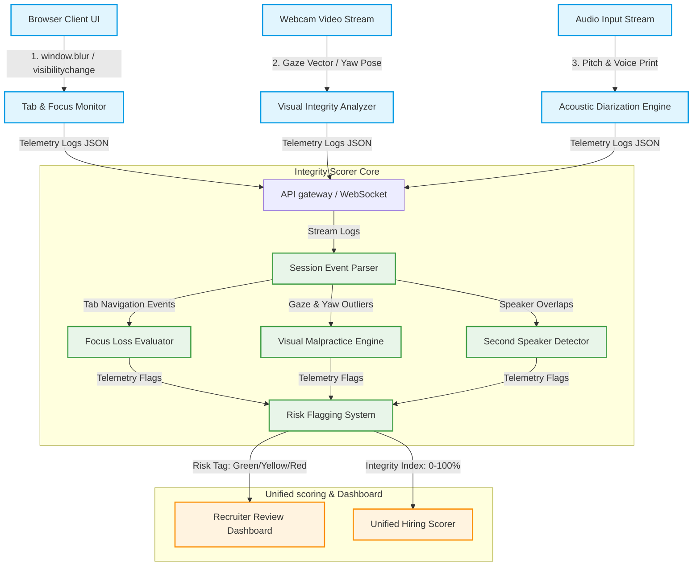

# Integrity & Malpractice Detection Framework

This framework specifies the **observable signals, network boundary topologies, and sensory trackers** that continuously evaluate candidate session integrity during virtual job assessments. It operates as a privacy-preserving audit assistant, mapping raw device telemetry into secure, verifiable compliance vectors.

---

## 1. System Topology & Video Telemetry Pipeline

The Integrity Detection System processes browser event boundaries, facial meshes, and audio signatures to verify that the registered candidate is answering the questions without external aid or window navigation:

---

## 2. Observable Malpractice Signals

### A. Tab Switching Frequency ($N_{tab}$)
*   **Physics of the Gaze**: Captured via browser tab focus loops (`document.visibilityState`).
*   **Significance**: Measures how often the candidate minimizes the interview screen or moves to other browser tabs to lookup answers.

### B. Loss of Screen Focus ($T_{blur}$)
*   **Physics of the Gaze**: Monitored via HTML5 focus/blur API hooks on the client window scope.
*   **Significance**: Tracks the cumulative duration the candidate spends interacting with outside application layers (e.g. text documents, AI helpers, communications).

### C. Acoustic Speaker Diarization ($V_{ext}$)
*   **Physics of the Gaze**: Processed using audio-frequency pitch analysis and acoustic voice-print validation.
*   **Significance**: Detects when a second distinct voice signature occurs concurrently with the interview audio, indicating an accomplice feeding answers in the background.

### D. Repeated Gaze Deviations ($G_{away}$)
*   **Physics of the Gaze**: Evaluates coordinates $(g_x, g_y)$ alongside head Pose Yaw angles from the `BehavioralScorer`.
*   **Significance**: Detects a candidate consistently looking off-camera (typically towards a physical accomplice or secondary mobile device) while speaking.
