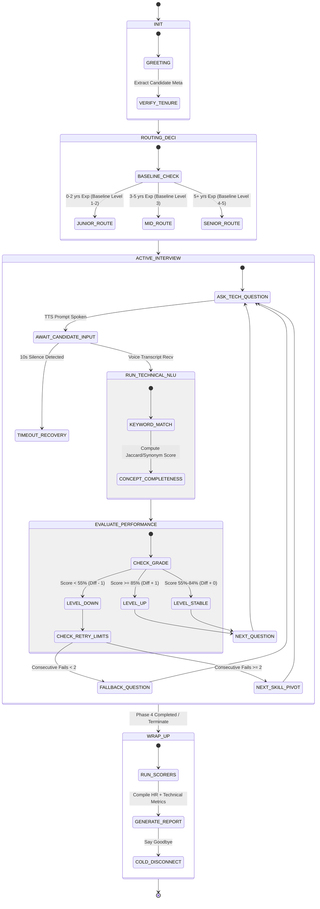
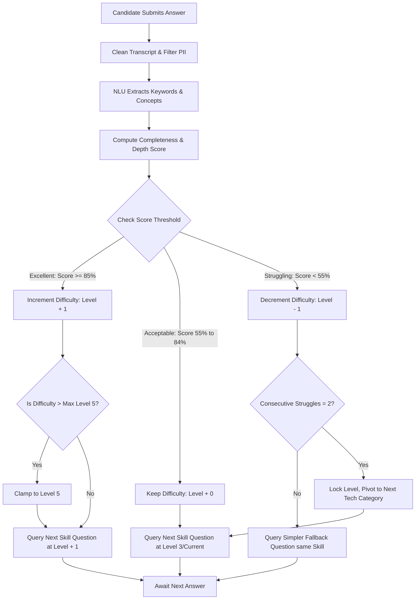

# Technical Interview Flow & Transition Design Diagram

This document contains visual diagrams and behavioral state specs for the **Technical Interview AI System**. It maps the core call states, the real-time adaptive difficulty grading loop, and exception-recovery transitions.

---

## 1. Complete Conversational & Difficulty FSM

This state diagram maps how the FSM transitions between interview phases, tracks years of experience, adjusts query difficulty level, and coordinates dynamic follow-up probing:

---

## 2. Adaptive Difficulty Decision Tree Logic

This tree diagrams the exact logical path the AI takes after receiving the candidate's technical answer:

---

## 3. Interview Phase Progressions

The interview operates as a sequential progression of phases:

```mermaid
gantt
    title Technical Interview Timeline (60 Minutes Allocation)
    dateFormat  X
    axisFormat %s
    
    section Stage 1
    Warmup & Identity Verification   :active, 0, 3
    
    section Stage 2
    Experience-Based project review  :crit, 3, 18
    
    section Stage 3
    Conceptual Core Deep-dive        : 18, 36
    
    section Stage 4
    Scenario System Design Problem   : 36, 57
    
    section Stage 5
    Session Scorer & Wrap-Up         :active, 57, 60
```

